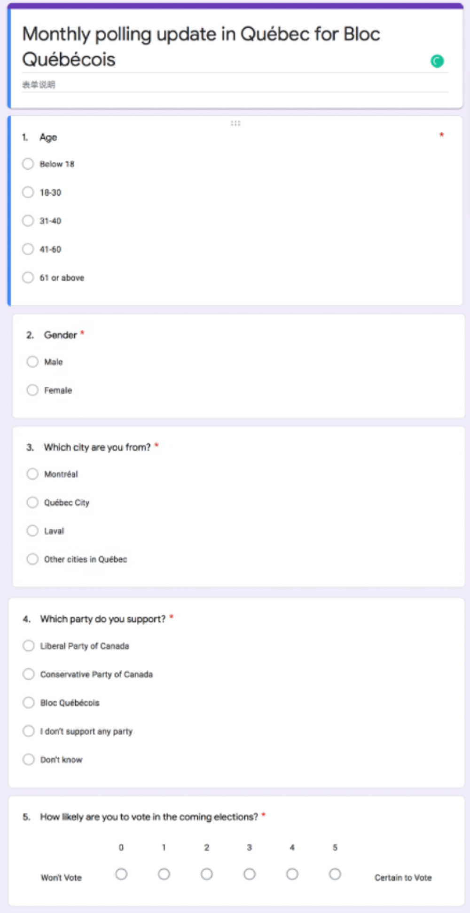

```{r setup, include=FALSE}
knitr::opts_chunk$set(echo = TRUE)
```


```{r,include=FALSE, eval=TRUE, echo=FALSE}
# install.packages('tidyverse')
# install.packages('tibble')
# install.packages('skimr')
# install.packages('ggplot2')
# install.packages('breakDown')
# install.packages('dplyr')
library(tidyverse)
library(tibble)
library(skimr)
library(ggplot2)
library(breakDown)
library(dplyr)
options(tinytex.verbose = TRUE)
```

# Executive Summary
## 1. The Task
We are entrusted by Bloc Quebecois to investigate their monthly polling rate in Quebec province. We conduct a stratified sampling survey and collect data from the population only in the province of Quebec. In terms of stratified sampling survey, we divide our sample into subgroups of the city to further examine the relationship between Party popularity with age and gender. Because we only take the population in the Quebec Province into account, a majority of voters are from the three major cities of Quebec. They are Laval, Montreal, Quebec City. Thus, we divide our sample into four geoFigureic groups to specifically study the percentage of Party popularity in different cities. To divide the population into subgroups, this sampling method is called a stratified sampling method.

## 2. What was done
We specifically take a look into our Party's popularity from three aspects, which are age, gender and city. We divide our sample age into five groups. They are aged under 18, aged between 18 to 30, aged between 41 to 60, and aged 61 or above. We also illustrate the gender distribution within each age group in our sample to better understand the percentage of females and males in each age group. This percentage variation may be an impact on our later analysis upon the Party's popularity with respect to gender. Besides, we also analyze the relationship between age and the likelihood to vote.

With a total of 30000 samples, we divide the city into four groups, such as Laval, Montreal, Quebec City and other cities in Quebec. We specifically pick Laval, Montreal and Quebec City because these three cities are the major populated cities in the province of Quebec. We examine the relationship between the city where the respondents are from with their likelihood to vote. Last but not least, we separately compare different Party popularity in relation to the age and city.

## 3. Why this Matter
With our analysis, we can further analyze the reason behind the people who do not know which Party to vote for.  With the data, we can specifically target different age groups' needs to better help our Party Bloc Quebecois to win over these undecided voters. Elders concern about medical benefits; middle-aged voters care about employment; youngers discuss more education. With our survey and data, we can better alter and polish our political direction in order to better help our citizens if we are elected.

\newpage
## 4. What was found
From our survey and analysis, we have found four major results. From the age distribution of the collected sample, the majority of respondents are middle-aged and seniors. They both show a similar distribution in terms of their willingness to vote. Middle-aged groups and elders take a large proportion of the people who are most willing to vote as well as the people who are most unwillingly to vote. For the respondents who are aged between 18 to 30, the percentage of their willingness to vote is less than that of people who are aged between 31 to 40. The second result is regarding gender distribution. In our sample, there are 49% males and 51% females. The proportion of female respondents who are less willing to vote is approximately the same as that of male respondents. The distribution also indicates a prediction of which female respondents are more willing to vote for next year's election. The third result is about the relation of the election in terms of location. Because we select our population only in Quebec province, the data shows that there is around one-third of our sampling population are from Montreal, Laval and Quebec City whereas the rest are from other Quebec's cities. The location distribution indicates that many of our respondents are not from Montreal, Laval and the City of Quebec. The largest proportion of respondents like to vote for the next election is from Montreal as we compared with that of other Quebec cities. The largest percentage of respondents of not voting also comes from Montreal. Respondents from Quebec City who choose to vote are more than Laval respondents. If considering the proportion of people who is unlikely to vote, the data and Figures demonstrate that the people from Quebec City are less likely to vote than the people from Laval. The last but not least, the Liberal Party of Canada wins the highest polling rate. Our Party follows the Liberal Party of Canada as the second popular Party in our sampling survey. Specifically, the Conservative Party of Canada is more popular than Bloc Québécois in Quebec City.

## 5. Some Weaknesses
In our data, there are several shortcomings that decrease our prediction preciseness. Firstly, our sample size is not large enough to conclude with an accurate prediction. Several simulated illustrations do not present a distinct difference. From the aspect of the technical problems, there are two issues. Our data is difficult to simulate for more than a hundred thousand. Our simulation is based on the real-world statistical data provided by Statistic Canada, which is mainly estimated. If the data we used is not accurate enough, our estimation may have a larger error.

## 6. Areas for future work.
After knowing the polling rate among different groups of people, we can predict the polling rate in the whole population in Quebec province. By knowing this information, we will know how we can improve the polling rate of Bloc Quebecois in the future. For example, people in different age groups care about different issues, youth care and middle-aged people both about education as well as the employment rate, and the seniors care about medical issues and pensions. Females care about gender equality in daily works and occupations, and people in different cities care about local security and livability. Bloc Quebecois can use these as their selling point to propagandize to let people know they care about inhabitants in Quebec than any other party in Canada; therefore, people will be more likely to support Bloc Quebecois.

```{r,eval=TRUE, echo=FALSE, warning=FALSE, message=FALSE}

set.seed(77) # Set.seed used for specify seed, in this way, if someone else run following code, they will get the same data as the author did.

age <- sample( c("Under 18", "18 - 30", "31 - 40", "41 - 60", "61 or above"), size = 30000, replace = TRUE, prob = c(0.15, 0.184, 0.186, 0.22, 0.27))  # Simulating sample age for the survey.

gender <- sample(x = c("Male", "Female"), size = 30000, replace = TRUE, prob = c(0.49, 0.51)) # Simulating gender for the survey.
      
city <- sample(x = c("Montréal", "Québec City", "Laval", "Other cities in Québec"), size = 30000, replace = TRUE, prob = c(0.25, 0.07, 0.07, 0.61)) # Simulating the result for the question that is "Which city are you from?"
      
likelyvote <- sample( c (0:5), size = 30000, replace = TRUE, prob = c(0.10, 0.02, 0.03, 0.05, 0.10, 0.70)) # Simulating the result for the question that is "How likely are you to vote in the coming elections?"

party <- NULL
for (i in 1 : 30000){
  if (city[i] == "Montréal"){
  party[i] <- sample( c("Liberal Party of Canada", "Conservative Party of Canada", "Bloc Québécois", "I don't support any party", "Don't know"), 1, replace = TRUE, prob = c(0.35, 0.05, 0.35, 0.2, 0.05))
    }
  if(city[i] == "Québec City"){
  party[i] <- sample( c("Liberal Party of Canada", "Conservative Party of Canada", "Bloc Québécois", "I don't support any party", "Don't know"), 1, replace = TRUE, prob = c(0.13, 0.5, 0.12, 0.2, 0.05))
  }
  else{
  party[i] <- sample( c("Liberal Party of Canada", "Conservative Party of Canada", "Bloc Québécois", "I don't support any party", "Don't know"), 1, replace = TRUE, prob = c(0.35, 0.09, 0.3, 0.25, 0.01))
    }
} # Simulating the result for the question that is "Which party do you support?" 

sample_polling <- tibble(age, gender, city, party, likelyvote) # This code provides data frame that looks much better than the traditional data frame.   

``` 

\newpage

# Introduction
In 2019, Bloc Quebecois finally back on its feet, winning over the Conservative Party of Canada. Bloc Quebecois became the second popular political Party in Quebec, behind Liberal Party. This year, 2020, Bloc Quebecois starts to think of a way to close up the gap with Liberal Party. How to win over voters is what Bloc Quebecois considering at present. We, Petit Poll, provides monthly polling update to Bloc Quebecois through conducting a stratified sampling survey and collect data from the population only in the province of Quebec.Through a stratified sampling survey, we collect data from the population of Quebec province to better understand our Party Bloc Quebecois popularity from three perspectives, which are age, gender and city. We divide our sample by the city which the respondents are from. From the city distribution, we further analyze the relationship of our Party popularity with age and gender. 

There are four major conclusions we analyzed from our survey. People who are middle-aged and elder are more likely to vote and attentive to politics and election. Although middle-aged people and elders are most likely to vote, they are also the people who are most unlikely to vote. This shows a distinct difference among the people who are middle-aged and elder. Secondly, the percentage of females who are less willing to vote is approximately the same as that of male percentage, but the female is more likely to vote for the next election. Thirdly, only one-third of our sample is from the three major cities of Quebec province (Montreal, Laval and City of Quebec). In terms of willingness to vote, people from Montreal are estimated to be the least willing to vote, following by Laval, then the City of Quebec. Fourthly, our data and Figures indicate that the Liberal Party of Canada is our competitor in Canada, whereas the Conservative Party of Canada is our competitor, specifically in the City of Quebec.

If we can know our polling rate over different categories of respondents, we can use this as an according to predict the population's; thus we know how to raise the polling rate in the future. Different groups of people care about different issues. If our propaganda can tell people that we care about these issues as them, they can know that we are the party that cares about the people, which we increase our polling rate in the future.

In the rest of our report, we are going to talk about these things. First, we want to briefly mention what methodologies and approaches we used in the survey. Second, we will mention how we get our data, which is the source of our data. Then before we start looking at data analysis, there is a data summary that can tell the reader what they can know before reading the next paraFigures of data discussion. Last, there are some shortcomings and weaknesses in this survey and analytical report.

## All codes used in this post can be found here: https://github.com/Nataliejyz/Who-are-more-likely-to-vote-for-Bloc-Quebecois-in-the-next-election-in-Canada-.git

\newpage
# Methodologies and Approaches
Our population is the residents who live in Quebec province. We get our sample by giving the survey online and to some specific community, and we randomly selected 30000 samples by each city. The method we used is Stratified sampling. We group the sample by cities because we want to know our polling rate in different cities and try to first raise the support rate where has the lowest. According to the statistical theories of stratified sampling, we know that the stratified sample mean is an unbiased estimator for the population mean. It's saying that the average of our samples is representing the population's average, in an idealistic presumption which assumes there is no bias in our study. 

Our survey is mainly conducted online, giving the respondents rewards to motivate them to complete the survey. The party can also cooperate with the companies that support Bloc Québécois so that these companies can distribute our survey down to their employees. In order to better reach our elder respondents, we will distribute our survey in the community center in a paper version to increase our elder age groups responding percentage.

We use Google Form to create the survey, so there is no cost in the process of survey production, but we have cost in the distribution process. In order to have a better response rate, the rewards are 10 dollar Amazon gift cards for online respondents and 10 dollar Shoppers gift cards for paper respondents. Our collected sample is 30000; our estimated cost is $300,000.

Through our process of surveying, we may face a non-response problem that our respondents are not willing to share with us his answer to our survey. The potential results from our selected samples will differ from what we expected. In a situation like the polls, people are not likely to answer because of privacy. And since we are giving a survey to get what we want to know, some people may think answering the survey is complicated. Therefore, in order to minimize the effects of the non-response problem, we need to guarantee our respondents' privacy issues, for example, sign a confidential contract; we also need to simplify our survey to make it more accessible to our respondents.

In terms of respondent privacy, we will have a privacy contract among our staff. Everyone related to this project must sign a confidential contract and must take responsibility if they violate confidential terms. We keep our respondent's names non-anonymous to ensure our survey's authenticity. Thus, we use confidential contracts to protect our respondent's privacy.

\newpage
# Source of Data
The data is simulated according to the real-world situation by referring to Statistics Canada and other authority websites. The online survey is created in Google Form and released at the beginning of October 2020 through two ways: online and give the seniors a paper version survey. The answers to the questions in the survey are simulated according to the real-world data provided by Statistics Canada, and we simulated a group of samples of 30000 people from Quebec. Therefore, the data includes people who are not registered to vote, for example, non-citizens and people aged below 18. In some cases, we drop the samples who are not eligible to vote in Canada, for example, inhabitants in different cities and parties they support. We expect the bias exists, we can't prevent all of them, for example, response error and non-response bias. Response error is the error made by our respondents, this could be unintended, which is unavoidable. However, some response error is intended by the respondents, we can avoid this by ensuring the respondent’s privacy and try not to tell them which party we are. The other bias is the non-response bias, which is due to some respondents who are not answering our question. To decrease the number of people who don’t respond, we can guarantee their privacy by signing things like the confident contract.

# Data Summary
Before starting to look at the Data Analysis, here are some main conclusions from our survey:
1.	The majority of our samples are middle-aged or seniors. Both middle-aged people and seniors are showing a similar distribution:  they are the majority among those who are willing to vote; however, among those who are not willing to vote, they also seem to be the majority. For those aged 18-30, their proportion willing to vote is less than those aged 31-40. 
2.	The gender distribution of our sample is similar, in which 49% are males and 51% are females. The proportion of females who are less willing to vote is almost the same as males. But more females seem to want to vote for the next election than males. 
3.	Due to the distribution of population in Quebec, about one-third population are from Montreal, Laval and Quebec City, and the rest of them are in other cities in Quebec. This shows that many of our respondents are not from these three cities. Montreal has the highest proportion of people who want to vote for the next election among all the cities in Quebec Province. At the same time, the proportion of not voting is also the highest. Quebec City has more people who want to vote than Laval, but fewer people who don’t want to vote, though Quebec City has a higher population than Laval.
4.	Our competitor is the Liberal Party of Canada, which has a higher polling rate. However, in Quebec City, the Conservative Party of Canada has a higher polling rate than us.

\newpage

# Data Analysis
First, we are going to focus on the diversity of age in our samples. By summarizing the age groups of our sample, we can predict the distribution of age groups in our population. It’s important to know the age of each sample because people of different ages are focusing on different social issues, for example, seniors are more interested in medical care and pensions, while youths care more about employments. Therefore, in order to earn a higher polling rate, it’s necessary for Bloc Québécois to briefly know their supporters’ age.

```{r, eval=TRUE, echo=FALSE, warning=FALSE, message=FALSE}
# For the first Figure, it provides the distribution of age groups among our sample. We used the code, "count", as counting the age group in the sample and "geom_bar" for plotting bar Figure. After that using the code "labs" for writing several of labels in the Figure.

set.seed(77)

count_age <- sample_polling %>%
  count(age)
ggplot(count_age, aes(x = reorder(age, n), y = n, fill = age)) +
  geom_bar(stat = "identity") +
  geom_text(aes(label = n), hjust = 0.5, vjust = 1) +
  theme_classic(base_size = 10) +
  labs(x = "Age", y = NULL, 
       title = "Age distribution of respondents",
       caption = "Source: The Statistics Canada",
       tag = "Figure 1")
```
  
Figure 1 shows us the distribution of age groups among our samples. By referring to the real-world statistics of ‘the age distribution in Quebec’ from Statistics Canada, we simulated 30000 samples as people who are from Quebec Province. The whole Figure shows an increasing trend, which means nearly half our sample is middle-aged and seniors. I will explain this in a more specific way, out of all the respondents in our survey, 14.8% are aged below 18; 18.3% are aged 18-30; 18.4% are aged 31-40; 22.1% are aged 41-60; 26.4% are aged 61 or above. Therefore, we are able to predict that nearly half of our respondents are middle-aged or seniors who care about pensions or medical care.

\newpage
Second, we will focus on the gender of our respondents. The difference in gender may affect the behavior of likely to vote or the party they support. For example, for certain occupations, whether the employment rate between males and females is equal, or if there is income inequality between males and females. Thus, gender will also factor in the polling rate for Bloc Québécois.

```{r, eval=TRUE, echo=FALSE, warning=FALSE, message=FALSE}


set.seed(77)

count_gender <- sample_polling %>%
  count(gender)

ggplot(count_gender, aes(x = reorder(gender, n), y = n, fill = gender)) +
  geom_bar(stat = "identity") +
  geom_text(aes(label = n), hjust = 0.5, vjust = -5) + 
  theme_classic(base_size = 10) +
  labs(x = "gender", y = NULL, 
       title = "Gender proportion of sampling distribution",
       caption = "Source: Statistics Canada",
       tag = "Figure 2")
```

By referring to ‘the gender distribution in Quebec’ from Statistics Canada, we simulated the gender distribution among our samples. From Figure 2, we can know that there are 49% male and 51% female. Our sample has slightly more females than males.


```{r, eval=TRUE, echo=FALSE, warning=FALSE, message=FALSE}
# For the third Figure,we combine the variable age group and gender together. We used the code "geom_bar" for plotting bar Figure. After that using the code "labs" for writing several of labels in the Figure. We used the code "scale_fill_brewer" for filling our Figure which would display well suited color schemes.

set.seed(77)
sample_polling %>% 
ggplot( aes(x = age, fill = gender))+
  geom_bar() + 
  labs(title = "Gender proportion in different age group", 
       x = NULL,
       y = "Count",
       tag = "Figure 3") +
  theme_classic(base_size = 10) +
  scale_fill_brewer(palette = "Set2") 
```


By combining the variable age group and gender together, we can know how age distributes between males and females (Figure 3).

Third, we want to focus on which city our samples from, since we focus in Quebec province. From the website City Population, we find that the estimated population in 2019-07-01 is about eight million. The reason why we don’t refer to the governmental website Statistics Canada is that the Census Program provides a statistical portrait of the country in every five years, the next Census program will start in 2021. Of these 8 million people, about two million are from Montreal, its population is 24.2% of the province and followed by Quebec and Laval, which are 6.7% and 5.2% respectively. The party can focus on these three cities, while the other cities are also important because their population is more than 50% in aggregate than these three cities.

\newpage
We referred to the real-world population and simulated our samples in different cities. The table below (Table1) shows us that, as expected, more than half of the respondents choose ‘Other cities in Quebec’, which is about 61% of the aggregate. Of the 25% of the samples are from Montreal, 7% from Laval, and 7% from Quebec City. To visualize the table, we made a Figure to show this distribution (Figure 4).


Table1
```{r, eval=TRUE, echo=FALSE, warning=FALSE, message=FALSE}

sample_polling %>% 
  group_by(city) %>% 
  summarize(n = n()) %>% 
  mutate(freq = round(n / sum(n), 2))

```

```{r, eval=TRUE, echo=FALSE, warning=FALSE, message=FALSE}
# For the fourth Figure, We used the code, "count", as counting the age group in the sample and "geom_bar" for plotting bar Figure. After that using the code "labs" for writing several of labels in the Figure.

set.seed(77)

count_city <- sample_polling %>%
  count(city)

ggplot(count_city, aes(x = reorder(city, n), y = n)) +
  geom_bar(stat = "identity", fill = "skyblue1", color = "white") +
  geom_text(aes(label = n), hjust = 0.5, vjust = 1.5) +
  theme_classic(base_size = 10) +
  labs(x = "City", y = NULL, 
       title = "Which city are sample from",
       caption = "Source: The Statistics Canada",
       tag = "Figure 4")

```
  
Next, we are going to find whether age or gender will influence people’s likelihood to vote. By knowing this, we can find out the reasons that lead people to vote/not vote and figure out how we can motivate people to vote, especially vote for Bloc Québécois.

```{r, eval=TRUE, echo=FALSE, warning=FALSE, message=FALSE}
# For the fifth Figure, We used the code "geom_bar" for plotting bar Figure. After that using the code "labs" for writing several of labels in the Figure.

set.seed(77)

sample_polling %>%
  ggplot() + 
  aes(x = likelyvote, fill = age)+
  labs(x = "likelyvote", y = NULL, 
       title = " Which age group is more willing to vote ",
       caption = "Source: Canadian Election Survey",
       tag = "Figure 5") +
  theme_classic(base_size = 10) +
  geom_bar(position = "dodge")  

```
  
How people aged differently are willing to vote in the next election? The answer to this question can observe from Figure 5, we notice a higher percentage of our respondents will vote for the next election, they seem to care more about politics or social issues. Among these people, a high proportion of seniors who want to vote, and a smaller proportion of people are below 18, though they are not eligible to vote yet, many of them are uninterested in political or social issues. For those who are less likely to vote for the next election, seniors are also the main group. According to Statistics Canada, the reasons for not voting differed in age groups are mainly due to two aspects, political reasons or everyday life and health issues.

```{r, eval=TRUE, echo=FALSE, warning=FALSE, message=FALSE}
# For the sixth Figure, We used the code "geom_bar" for plotting bar Figure. After that using the code "labs" for writing several of labels in the Figure.

set.seed(77)


sample_polling %>%
  ggplot() + 
  aes(x = likelyvote, fill = gender)+
  labs(x = "likelyvote", y = NULL, 
       title = "Which gender is more willing to vote",
       caption = "Source: Canadian Election Survey",
       tag = "Figure 6")+
  theme_classic(base_size = 10) +
  geom_bar() +
  facet_wrap( ~ gender)

```
  
Then we want to figure out if gender affects people’s likelihood to vote. Between males and females, their propensity to vote is similar, females have a slightly higher tendency to vote, this is observed from Figure 6. However, for not willing to voting in the election, males and females have almost the same proportion. Statistics Canada finds out that, most of them not voting due to everyday life and health issues, or political reasons.

```{r, eval=TRUE, echo=FALSE, warning=FALSE, message=FALSE}
# For the seventh Figure, We used the code "geom_bar" for plotting bar Figure. After that using the code "labs" for writing several of labels in the Figure.

set.seed(77)

sample_polling %>%
  ggplot() + 
  aes(x = likelyvote, fill = city)+
  labs(x = "likelyvote", y = NULL, 
       title = "In which city, people are more willing to vote",
       caption = "Source: Canadian Election Survey",
       tag = "Figure 7")+
  theme_classic(base_size = 10) +
  geom_bar() 

```
  
The last variable that we want to know its influence on likelihood to vote is city. Figure 7 shows the relationship between city and likelihood to vote. Most people in Quebec tend to vote, especially those who are in ‘Other cities in Quebec’ since their population is far higher than the rest three cities. Montreal, where has the most population in Quebec, it's also showing that many of its inhabitants are willing to vote for the next election. For those who are less possible or not going to vote, their distribution is affected by the population proportion among these cities. Most of them are in ‘Other cities in Quebec’, and the least of them are from Quebec City.

```{r, eval=TRUE, echo=FALSE, warning=FALSE, message=FALSE}
# For the eighth Figure, We used the code,"filter" for filtering the sample whose age is under 18. Then, using the code, "count", as counting the age group in the sample and "geom_bar" for plotting bar Figure. After that using the code "labs" for writing several of labels in the Figure. Last, the code "coord_flip" is used for flipping the Cartesian coordinates.

set.seed(77)

sample_polling_party <- 
  sample_polling %>% 
  filter(age != "Under 18")

count_party <- sample_polling_party %>%
  count(party)


ggplot(count_party, aes(x = reorder(party, n), y = n)) +
  geom_bar(stat = "identity", fill = "orange", color = "white") +
  geom_text(aes(label = n), hjust = 0.7) +
  labs(x = "Party", y = NULL, 
       title = "Which party is sample adult support",
       caption = "Source: The Statistics Canada",
       tag = "Figure 8")+
  theme_classic(base_size = 10) +
  coord_flip()

```
  
Finally, we are going to talk about which party people will vote for. This will let us know our competitors, also knowing the polling rate of our party. We exclude people who are not able to vote, which are aged below 18; our sample size changed to 25570 from 30000. After adjusting the sample size, the proportion of different age groups changed. People who are in the age group 18-30 is 21.5% of the aggregate. About 21.5% are people aged 31-40, 26% are people who in the age group of 41-60. The majority is the seniors, who are 31% of the whole adjusted sample size. Then from Figure 8, we find out that 33.4% of the aggregate are the supporters of the Liberal Party of Canada; Bloc Québécois has the support rate of 28.6%; about 24.7% people are saying that they don’t support any parties; 12% of the aggregate support Conservative Party of Canada; only a few of the aggregate don’t know which party they are supporting, which is 1.3%. We can conclude that our biggest competitor is the Liberal Party of Canada, which has a higher polling rate than us. 

\newpage
Knowing the general polling rate among different parties is not enough, it's better to find out how different parties are supported by people of different ages or cities in Quebec province. By knowing the people’s attitudes over political parties, Bloc Québécois can find out their next step to improve their polling rate. Since people of different ages and cities are caring for different issues of many aspects, this could be the point for Bloc Québécois to start changing their propaganda slogans or some policies.
```{r, eval=TRUE, echo=FALSE, warning=FALSE, message=FALSE}
# For the ninth Figure, We used the code,"geom_bar",for plotting bar Figure. After that using the code "labs" for writing several of labels in the Figure. Last, the code "coord_flip" is used for flipping the Cartesian coordinates.

sample_polling_party %>% 
ggplot(aes(x = party, fill = age)) +
  geom_bar() + 
  labs(title = "Which party do people of different ages support", 
       x = NULL,
       y = "Count",
      tag = "Figure 9") +
  theme_classic(base_size = 10) +
  scale_fill_brewer(palette = "Set3") +
  coord_flip()
```

  
In Figure 9, the overall polling rate of the Liberal Party of Canada is the highest, then followed by Bloc Québécois. More than half of the supporters of both the Liberal Party of Canada and Bloc Québécois are the seniors. Youth and the middle-aged are having the same proportion that supporting both parties, though the number of supporters is higher in the Liberal Party of Canada than Bloc Québécois. It is also noticeable that the seniors are still the majority who don’t support any parties. This is possible since seniors are bothered by health problems, that some of them will be less caring about politics. To conclude, the polling rate among different parties distributes is similar to the age distribution in the samples.
\newpage
```{r, eval=TRUE, echo=FALSE, warning=FALSE, message=FALSE}
# For the last Figure, We used the code, "geom_bar", for plotting bar Figure. After that using the code "labs" for writing several of labels in the Figure. Last, the code "coord_flip" is used for flipping the Cartesian coordinates.


set.seed(77)

sample_polling_party %>%
  ggplot() + 
  aes(x = city, fill = party) +
  labs(x = "city", y = NULL, 
       title = "Which party do people in different cities support",
       caption = "Source: Canadian Election Survey",
       tag = "Figure 10") +
  geom_bar(position = "dodge") +
  theme_classic(base_size = 10) +
  scale_fill_brewer(palette = "Set1") +
  coord_flip()

```

Figure 10 is showing the relationship between cities and parties, and the next page table (Table2) summarized the details of this Figure. In Montreal, the Liberal Party of Canada (34%) has a 4% higher polling rate than Bloc Québécois (30%). Only 9% of our samples from Montreal support the Conservative Party of Canada. Laval has the same probability of polling rate as Montreal, though it has a smaller sample size. In Quebec City, half of our sample support the Conservative Party of Canada (52%), then 19% of them saying that they don’t support any parties. Bloc Québécois and the Liberal Party of Canada have the same polling rate here, which is 12% respectively. In the other cities in Quebec, the Liberal Party of Canada (35%) still has a 5% higher polling rate than Bloc Québécois (30%), and only 9% of our samples support the Conservative Party of Canada. Therefore, we can conclude that in Quebec City, our biggest competitor is the Conservative Party of Canada, otherwise, our competitor is always the Liberal Party of Canada.
\newpage
Table2
```{r, eval=TRUE, echo=FALSE, warning=FALSE, message=FALSE}

sample_polling_party %>% 
  group_by(city, party) %>% 
  summarize(n = n()) %>% 
  mutate(freq = round(n / sum(n), 2))
```


# Shortcomings or Weaknesses
  The shortcomings in our data are: 1. The sample size is not large enough to make predictions. 2. Some simulated Figures are not showing a noticeable difference, which may mislead our readers. 3. We are not showing that some variables are having relations, our analysis will not be that strong evidenced.

  The weaknesses of our data are mainly due to the technical issues: 1. It's difficult to simulate data for more than a hundred thousand. 2. If we want to relate the variables, it’s really time-consuming, and sometimes, it’s not able to show us the results. 3. Our simulation is based on the real-world statistical data provided by Statistic Canada, which is a secondary source. And Statistics Canada states that the data they provided is mainly estimated, which is not exactly what it should be in the reality.

  The Shortcomings and weaknesses of our survey and analysis: 1. We ignore people who are not able to vote (non-citizens), which will overestimate the result. 2. The survey is too short, and the questions are too board, this can only give Bloc Québécois a general idea on their polling rate.


# Appendix
https://docs.google.com/forms/d/1GQd3VSIU61hoil94i9cfR23KHqXdymYPmOaRfoX3Yds/edit
\newpage
```{r pressure, echo=FALSE, out.width = '100%'}

```

\newpage
# References
 1. America. (n.d.). Retrieved October 07, 2020, from https://www.citypopulation.de/en/canada/admin/24__qu%C3%A9bec/

 2. Elin Waring, Michael Quinn, Amelia McNamara, Eduardo Arino de la Rubia, Hao Zhu and Shannon Ellis (2020). skimr: Compact and Flexible Summaries of Data. R package version 2.1.2. https://CRAN.R-project.org/package=skimr

 3. Government of Canada, S. (2020, February 26). Table2Reasons for not voting by age group and sex, 2019 federal election. Retrieved October 07, 2020, from https://www150.statcan.gc.ca/n1/daily-quotidien/200226/t002b-eng.html

 4. Hadley Wickham, Romain Fran?ois, Lionel Henry and Kirill Müller (2020). dplyr: A Grammar of Data Manipulation. R package version 1.0.2. https://CRAN.R-project.org/package=dplyr

 5. Jeffrey B. Arnold (2019). ggthemes: Extra Themes, Scales and Geoms for ‘ggplot2’. R package version 4.2.0.https://CRAN.R-project.org/package=ggthemes

 6. JJ Allaire and Yihui Xie and Jonathan McPherson and Javier Luraschi and Kevin Ushey and Aron Atkins and Hadley Wickham and Joe Cheng and Winston Chang and Richard Iannone (2020). rmarkdown: DynamicDocuments for R. R package version 2.3. URL https://rmarkdown.rstudio.com.

 7. Kirill Müller and Hadley Wickham (2020). tibble: Simple Data Frames. R package version 3.0.3. https://CRAN.R-project.org/package=tibble

 8. RStudio Team (2020). RStudio: Integrated Development for R. RStudio, PBC, Boston, MA URL http://www.rstudio.com/.

 9. Staniak M, Biecek P (2018). "Explanations of Model Predictions with live and breakDown Packages."_The R Journal_. doi: 10.32614/RJ-2018-072 (URL: https://doi.org/10.32614/RJ-2018-072), <URL:https://journal.r-project.org/archive/2018/RJ-2018-072/index.html>.

 10. Statistics Canada. Table 17-10-0005-01 Population estimates on July 1st, by age and sex https://www.citypopulation.de/en/canada/admin/24__qu%C3%A9bec/ 

 11. Stephenson, Laura B; Harell, Allison; Rubenson, Daniel; Loewen, Peter John, 2020, '2019 Canadian Election Study - Online Survey', https://doi.org/10.7910/DVN/DUS88V, Harvard Dataverse, V1.

 12. Wickham et al., (2019). Welcome to the tidyverse. Journal of Open Source Software, 4(43), 1686,https://doi.org/10.21105/joss.01686.

 13. Yihui Xie andJ.J. Allaire and Garrett Grolemund (2018). R Markdown:The Definitive Guide. Chapman and Hall/CRC. ISBN 9781138359338. URL https://bookdown.org/yihui/rmarkdown.